# CS Hardware - Day 5

## Control

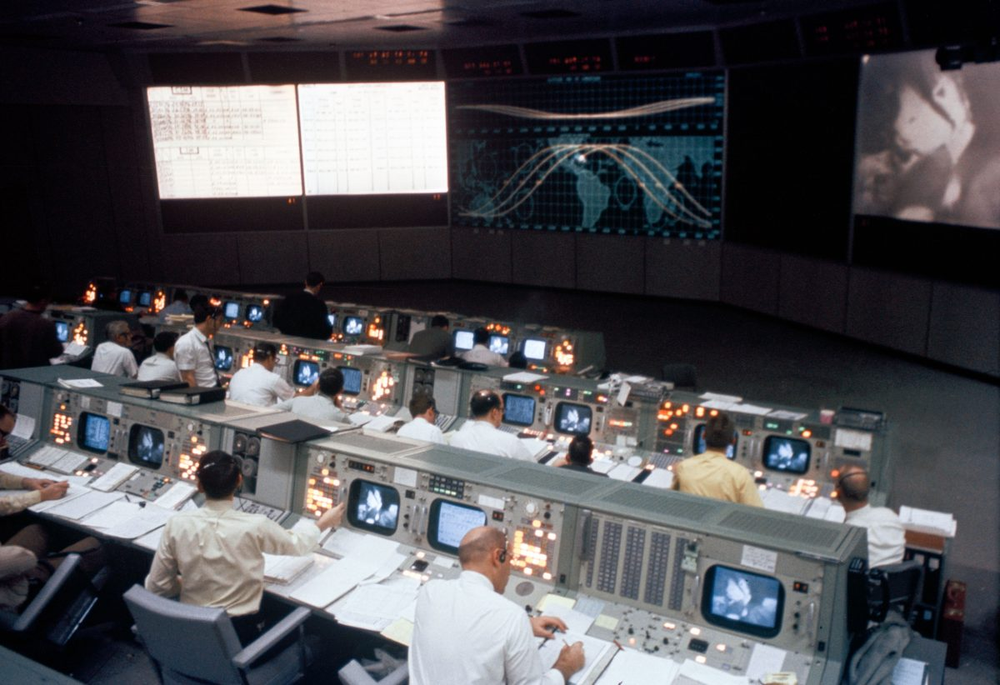

<!-- Alternate Image

-->

---

# Goal For Today

By the end of today you will:

- Understand what a microcontroller is
- Program a BBC micro:bit
- Connect software to hardware
- Build interactive embedded systems

---

# Review From Day 4

Yesterday we learned:

- Integrated Circuits combine many components
- Oscillators create timing signals
- Digital systems use HIGH and LOW voltages
- Computers depend on clocks

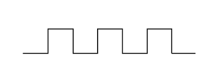

---

# Review From Day 3

We learned:

- Capacitors introduce TIME
- RC circuits create delays
- Oscillators repeatedly switch ON and OFF

---

# Review From Day 2

We learned:

- Transistors act like switches
- Logic gates make decisions
- Computers are built from billions of transistors

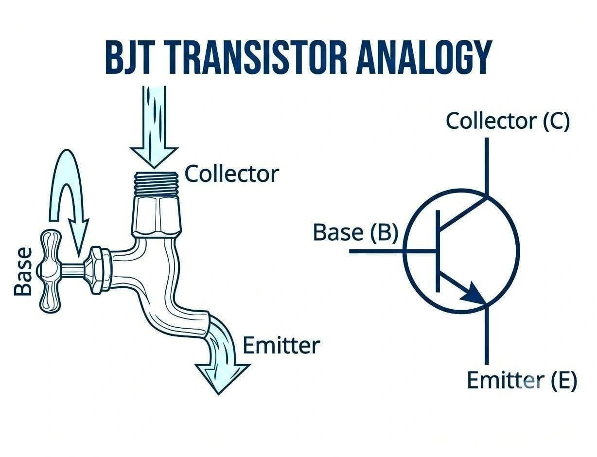

---

# Review From Day 1

Yesterday we learned:

- Voltage pushes current
- Resistance limits current
- LEDs have polarity
- Ohm's Law: **V = I × R**
- Multimeters help us debug circuits

---

<!-- 

Curta Mechanical Calculator (1948–1972)

Looks like a strange mechanical artifact
Hundreds of moving parts
Entirely mechanical
The Curta was considered one of the best portable calculators before electronic calculators displaced it in the 1970s.

 -->

# The Calculator Problem

In the 1960s, every calculator needed custom hardware.

- expensive
- difficult to redesign
- lots of specialized circuitry

<!-- INSTRUCTOR NOTES

In 1964, Sharp introduced the world's first all-transistor diode desktop calculator, the Compet, CS-10A.

desk sized
~30 pounds

-->

---

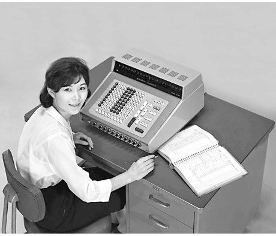

---

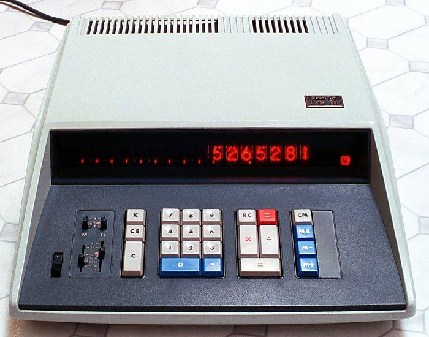

---

# Just A Few Years Later

Calculators became:

- pocket sized
- cheaper
- battery powered
- widely available

What changed?

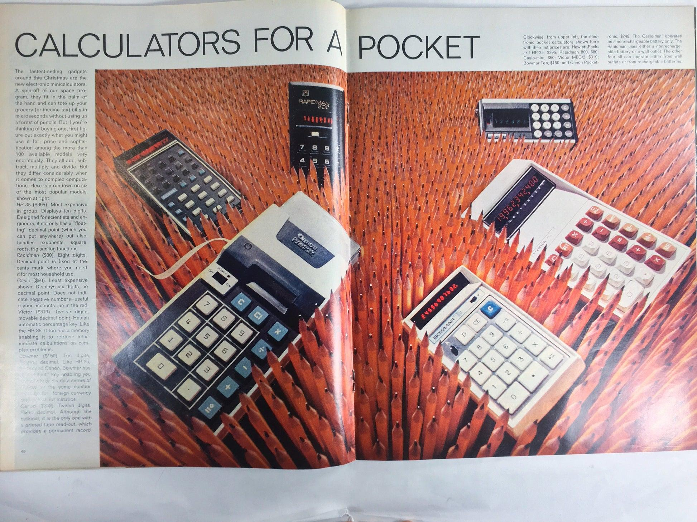

---

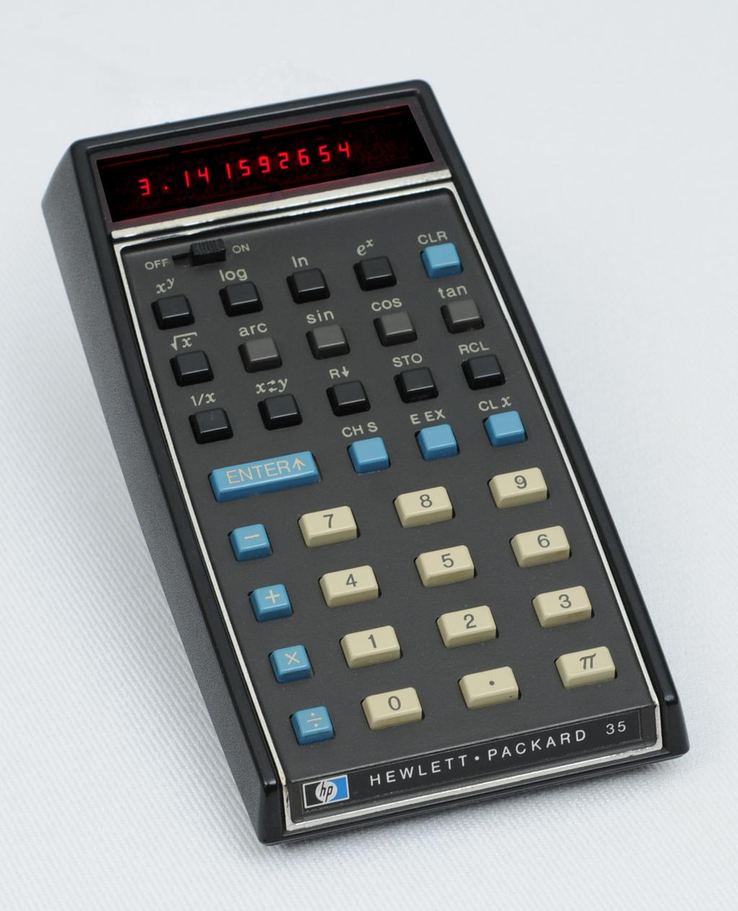

---

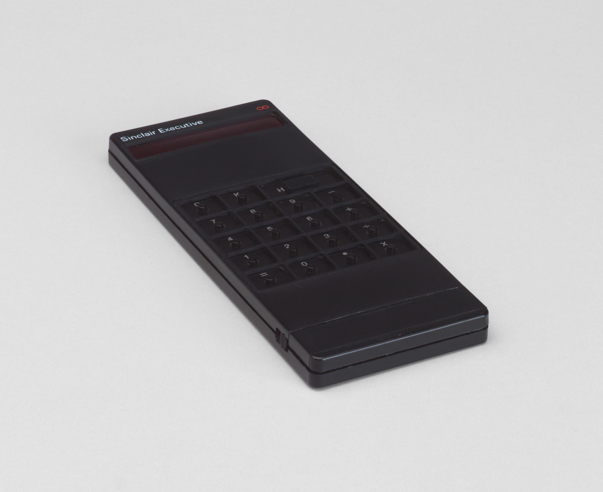

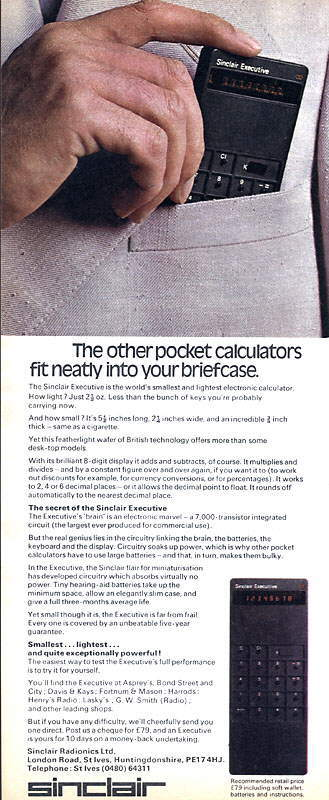

---

# A New Idea

What if we built a computer that could be reprogrammed?

Instead of changing *hardware*, we could change *software*.

<!-- INSTRUCTOR NOTES

The first commercially available microprocessor is generally considered to be the Intel 4004, introduced by Intel in 1971. 

The 4004 combined the functions of a computer's central processing unit (CPU) onto a single chip, which was a major breakthrough in computer engineering.

Originally developed for calculators made by the Japanese company Busicom.

-->

---

# Yesterday

One integrated circuit (IC) could generate a wave.

---

# Today the CPU

The Central Processing Unit (CPU) is the "brain" and performs many jobs,.

This idea led to:

- calculators
- computers
- microcontrollers
- phones
- embedded systems

<!-- NOTES

also called a microprocessor

like reading instructions, performing calculations, and controlling outputs
-->

---

# Microcontroller

Microcontrollers went even further

> A complete computer on a single integrated circuit.

CPU + Memory + Inputs + Outputs

All on one chip.

<!-- 

Texas Instruments TMS1000
1974
Microcontroller

-->

---

# Look Around

How many computers are here?

<!-- 

Most people say:
laptops
phones
Slide

The actual answer is:
- thermostat
- projector
- smoke detector
- microwave
- coffee machine
- elevator
- car keys

-->

---

# Embedded Systems

Most computers today are not PCs. They are tiny specialized computers called embedded systems powered by microcontrollers.

- microwaves
- washing machines
- thermostats
- toys
- cars
- robots

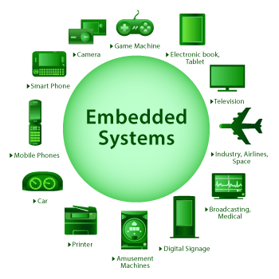

---

# Meet The micro:bit

The BBC micro:bit is a microcontroller designed for learning.

Built-in:

- LEDs
- buttons
- sensors
- radio
- USB

---

# What's On The Board?

- 5x5 LED matrix
- Buttons A and B
- Accelerometer
- Compass
- Temperature sensor
- Radio
- and more!

---

# Demo: Hello World

Display:

HELLO WORLD

on the LED matrix.

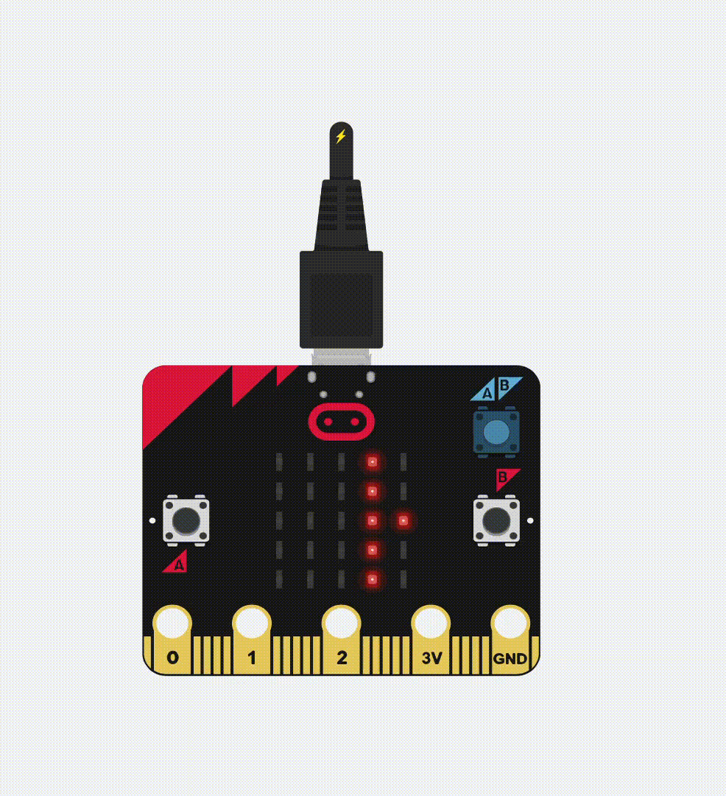

<!-- 

TODO: show the block builder and micropython options

Mention the main loops (on start and forever)

-->

---

# Lab Breakout #1

## Name Badge

Create a scrolling name badge.

Requirements:

- Show your name
- Add an icon
- Customize the message

<!-- TODO: show don't tell
# Inputs

Inputs tell the computer what is happening.

Examples:

- buttons
- sensors
- switches
- microphones

---

# Outputs

Outputs allow the computer to affect the world.

Examples:

- LEDs
- speakers
- motors
- displays

  -->

---

# Imagine designing a traffic light

You need it to:
- switch lights at the right time
- detect button presses
- respond to emergencies
- coordinate with nearby intersections

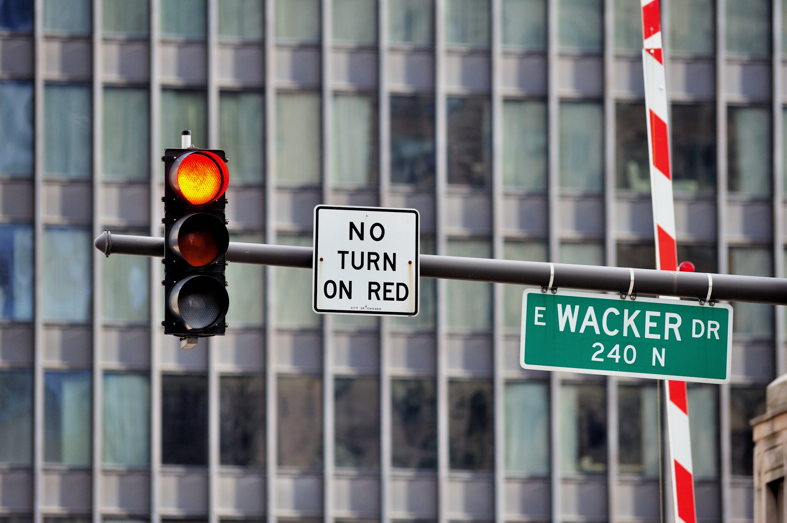

<!-- INSTRUCTOR NOTES

old traffic light controller with relays

You could build this using:
- transistors
- logic gates
- timers
- relays

But every new feature requires rewiring hardware.

Changing this behavior using software makes this much easier. This is where a microcontroller shines 

-->

---

# Demo: Traffic Light

- Let's build a mini traffic light using the Micro:bit

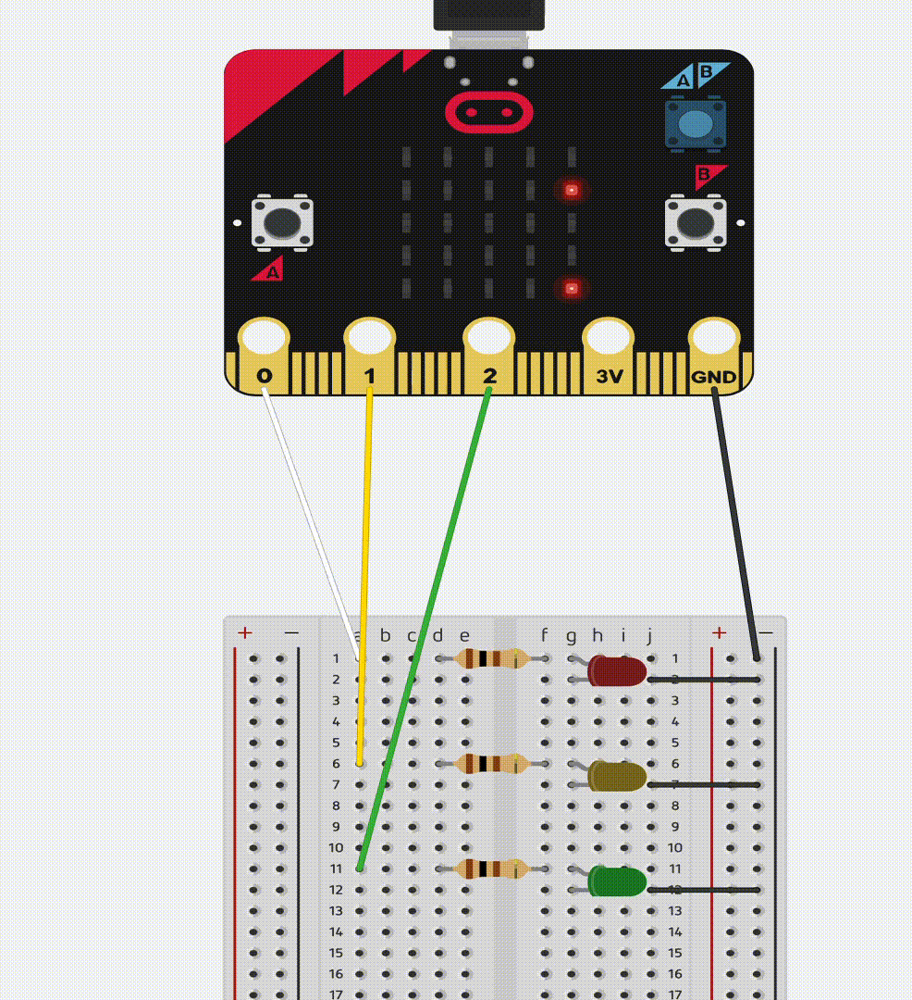

---

# Lab Breakout #2

## Traffic Light

Create a traffic light using the Micro:bit, a breadboard, and LEDs

---

# Key Takeaways

<!--

- Microcontrollers are computers on a chip
- Programs control hardware
- Inputs and outputs connect computers to the world
- Sensors provide information
- Timing still matters
- Embedded systems are everywhere
- Software and hardware work together

-->